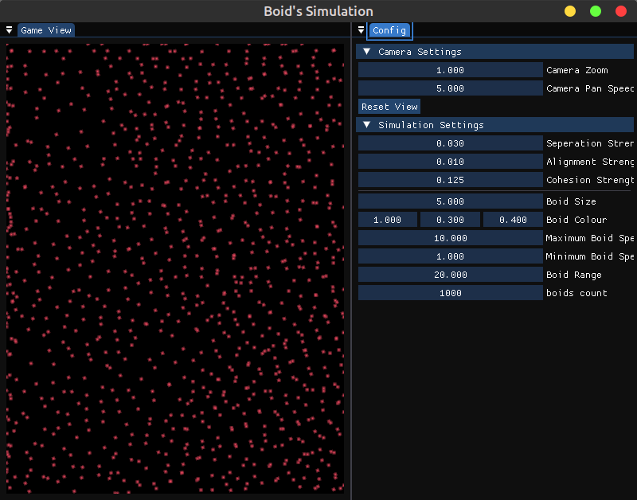

import Task from "../components/task.tsx";

#### Todo

<Task>Port to WebAssembly</Task>
<Task checked={true}>Implement spatial partitioning</Task>

[Github link](https://github.com/James1404/rama-lang)

